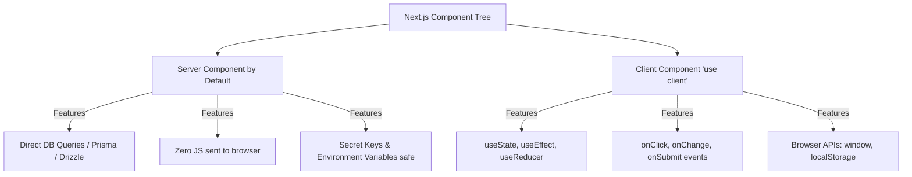
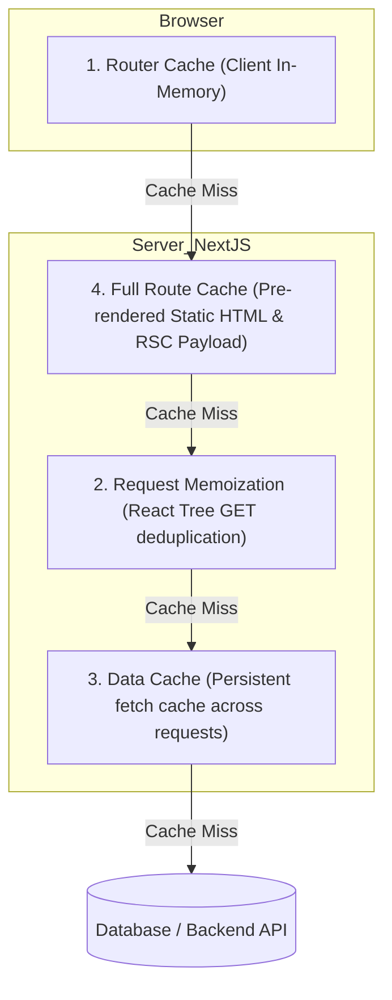

# 🚀 Complete Next.js Mastery & Learning Journey

[](https://nextjs.org/)
[](https://react.dev/)
[](https://tailwindcss.com/)
[](https://www.typescriptlang.org/)

A structured, beginner-friendly, and comprehensive guide to mastering modern full-stack web development with **Next.js (App Router)**. This repository contains progressive learning levels (`level-one` to `level-6`), hands-on projects, deep architectural explanations in plain English with real-life analogies, and a complete **Next.js Interview Preparation Handbook**.

---

## 📑 Table of Contents

1. [📂 Repository Structure & Learning Roadmap](#-repository-structure--learning-roadmap)
2. [💡 Next.js Explained in Plain English (With Real-World Analogies)](#-nextjs-explained-in-plain-english)
3. [🏛️ Core Next.js Architecture Deep Dive](#-core-nextjs-architecture-deep-dive)
   - [1. App Router Special Files](#1-app-router-special-files-cheat-sheet)
   - [2. Server Components (RSC) vs Client Components](#2-server-components-rsc-vs-client-components)
   - [3. Routing Mastery (Dynamic, Catch-all, Route Groups, Parallel & Intercepting Routes)](#3-routing-mastery)
   - [4. Next.js 15+ Breaking Change: Async Request APIs](#4-nextjs-15-breaking-change-async-request-apis)
   - [5. Rendering Strategies: SSR, SSG, ISR & CSR](#5-rendering-strategies-ssr-ssg-isr--csr)
   - [6. The 4-Layer Caching System](#6-the-4-layer-caching-system)
   - [7. Backend Route Handlers (REST APIs)](#7-backend-route-handlers-rest-apis)
   - [8. Server Actions & Mutations (Forms & Optimistic UI)](#8-server-actions--mutations)
   - [9. Built-in Performance Optimizations (Image, Font, Script)](#9-built-in-performance-optimizations)
   - [10. Middleware & Edge Runtime](#10-middleware--edge-runtime)
   - [11. Metadata & SEO Optimization](#11-metadata--seo-optimization)
4. [⚠️ Common Next.js Errors & How to Fix Them](#️-common-nextjs-errors--troubleshooting)
5. [🎯 Top 30+ Next.js Interview Questions & Answers](#-top-30-nextjs-interview-questions--answers)
6. [💻 How to Run This Project Locally](#-how-to-run-this-project-locally)
7. [👨‍💻 Author & Contributions](#-author--contributions)

---

## 📂 Repository Structure & Learning Roadmap

Each folder in this workspace demonstrates a specific milestone in the Next.js learning curve:

```text
Next.js/
│
├── 📁 level-one/            # Milestone 1: App Router basics, root layout, and page structure
├── 📁 level-2/              # Milestone 2: Routing (Static, Dynamic [id], Catch-all [...slug], Route Groups)
├── 📁 level-3/              # Milestone 3: Navigation (<Link>, useRouter) & Image Optimization (next/image)
├── 📁 level-4/              # Milestone 4: TypeScript Integration, component prop interfaces & global types
├── 📁 level-5/              # Milestone 5: Full-Stack Route Handlers (GET, POST, PUT, Query Params)
├── 📁 level-6/              # Milestone 6: Rendering Strategies (SSR, SSG, ISR, and Client Fetching)
├── 📁 practice-project1/    # Practical Project: "Travel Guide" with dynamic routing & parallel slots
└── 📄 README.md             # Complete Documentation & Interview Guide
```

---

## 💡 Next.js Explained in Plain English

### What is Next.js?
If **React** is an engine, **Next.js** is a complete, luxury car. 

In pure React (Vite / Create React App):
* Your browser receives an empty HTML file (`<div id="root"></div>`) and a massive JavaScript bundle.
* The browser must download, parse, and execute all JavaScript before the user sees anything. This is slow for users with weak mobile devices or poor internet, and search engine crawlers (Google, Bing) struggle to index your content (poor SEO).

In **Next.js**:
* The server pre-renders HTML with your data and sends ready-to-view HTML directly to the browser.
* The user sees content **instantly** (fast First Contentful Paint).
* Search engines get fully populated HTML (great SEO).
* You can write both **Frontend** (React UI) and **Backend** (API routes, database queries, Server Actions) in a single unified framework.

---

### 🍳 The Restaurant Analogy: Server vs Client Components

Imagine a restaurant:
* **The Server is the Kitchen**:
  * Where the heavy cooking happens (database queries, secret recipes/API keys).
  * The customer never enters the kitchen.
  * *Result*: Safe, fast, and no heavy pots/pans are sent to the customer's table (**zero JavaScript bundle sent to the browser**).
* **The Client is the Dining Table**:
  * Where the customer interacts: eating food, clicking a salt shaker, calling the waiter (**`onClick` events, typing in inputs, `useState`**).
* **The Golden Rule**: Do all the heavy cooking in the kitchen (Server Components). Only bring small items to the dining table when the user needs to touch or interact with them (Client Components with `'use client'`).

---

## 🏛️ Core Next.js Architecture Deep Dive

### 1. App Router Special Files (Cheat Sheet)

In the `app/` directory, folder names define URL paths, and special filenames define behavior:

| Filename | Purpose | Analogy | Environment |
| :--- | :--- | :--- | :--- |
| `page.js` / `.tsx` | The unique UI content for a specific URL. | The main dish on your plate. | Server (default) |
| `layout.js` / `.tsx` | Shared UI shell across routes (e.g., Header, Sidebar, Footer). Does **not** re-render on navigation. | The dining table frame that stays in place. | Server (default) |
| `template.js` / `.tsx` | Like layout, but creates a **brand-new instance** on every page switch (resets state, triggers page animations). | A fresh tablecloth for each new guest. | Server (default) |
| `loading.js` / `.tsx` | Instant loading skeleton using React Suspense. | The "Your food is being prepared" buzzer. | Server / Client |
| `error.js` / `.tsx` | Error boundary catching runtime exceptions in its route segment. | The backup dish if a kitchen mistake happens. | **Client (`'use client'`)** |
| `not-found.js` / `.tsx` | Custom 404 UI rendered when a page does not exist or `notFound()` is called. | "Sorry, this item is not on the menu." | Server (default) |
| `route.js` / `.ts` | Backend REST API endpoint (`GET`, `POST`, `PUT`, `DELETE`). | The delivery window for takeout orders. | Server |

---

### 2. Server Components (RSC) vs Client Components

Next.js App Router defaults to **Server Components**. You only opt into Client Components when you explicitly write `'use client'` at the very top of the file.



#### Code Example: Server Component (Fetching Data directly)
```tsx
// app/products/page.tsx (Server Component - Default)
// Notice: No useEffect, no useState, no loading spinners needed!
export default async function ProductsPage() {
  const res = await fetch('https://api.example.com/products');
  const products = await res.json();

  return (
    <div>
      <h1>Product List</h1>
      {products.map((item: any) => (
        <p key={item.id}>{item.name} - ${item.price}</p>
      ))}
    </div>
  );
}
```

#### Code Example: Client Component (Interactivity)
```tsx
// components/Counter.tsx
'use client'; // Required for hooks & browser events

import { useState } from 'react';

export default function Counter() {
  const [count, setCount] = useState(0);

  return (
    <button onClick={() => setCount(count + 1)} className="px-4 py-2 bg-blue-500 text-white rounded">
      Clicked {count} times
    </button>
  );
}
```

#### ⭐ The Golden Pattern: Passing Server Components as `children`
When you need interactive wrapper UI (e.g. modal, collapsible sidebar) without converting all your data-fetching components into Client Components:

```tsx
// components/CollapsibleSidebar.tsx (Client Component)
'use client';
import { useState } from 'react';

export default function CollapsibleSidebar({ children }: { children: React.ReactNode }) {
  const [open, setOpen] = useState(true);
  return (
    <div>
      <button onClick={() => setOpen(!open)}>Toggle Sidebar</button>
      {open && children} {/* Server Component passed as child remains on the server! */}
    </div>
  );
}

// app/dashboard/page.tsx (Server Component)
import CollapsibleSidebar from '@/components/CollapsibleSidebar';
import HeavyServerData from '@/components/HeavyServerData';

export default function Page() {
  return (
    <CollapsibleSidebar>
      <HeavyServerData /> {/* Renders on server, zero bundle cost! */}
    </CollapsibleSidebar>
  );
}
```

---

### 3. Routing Mastery

#### A. Static vs Dynamic Routes
* **Static Route**: `app/about/page.tsx` &rarr; `/about`
* **Dynamic Route**: `app/blog/[slug]/page.tsx` &rarr; `/blog/nextjs-guide`, `/blog/react-tutorial`
* **Catch-All Route**: `app/shop/[...categories]/page.tsx` &rarr; `/shop/clothes/men/shirts` (receives array `['clothes', 'men', 'shirts']`)
* **Optional Catch-All Route**: `app/docs/[[...slug]]/page.tsx` &rarr; matches `/docs` as well as `/docs/setup/install`

#### B. Route Groups `(folder)`
Wrap folder names in parentheses `()` to organize code without altering the public URL:
* `app/(marketing)/about/page.tsx` &rarr; `/about`
* `app/(dashboard)/analytics/page.tsx` &rarr; `/analytics`
* *Use Case*: Applying different layouts (e.g., Auth layout without navbar vs Dashboard layout with sidebar).

#### C. Parallel Routes (`@slot`) & Intercepting Routes (`(.)`)
* **Parallel Routes (`@slot`)**: Render multiple independent sub-pages simultaneously in the same layout.
* **Intercepting Routes**: Load a modal route while preserving context (Instagram-style photo modal where the feed remains visible behind the modal on click, but direct URL visit loads the full photo page).

---

### 4. Next.js 15+ Breaking Change: Async Request APIs

> ⚠️ **Crucial Interview Point**: Starting in Next.js 15+, request-specific parameters (`params`, `searchParams`, `cookies()`, and `headers()`) are **asynchronous Promises**.

```tsx
// app/profile/[username]/page.tsx
export default async function ProfilePage({
  params,
  searchParams,
}: {
  params: Promise<{ username: string }>;
  searchParams: Promise<{ tab?: string }>;
}) {
  // Always await params and searchParams in Next.js 15+
  const { username } = await params;
  const { tab } = await searchParams;

  return (
    <div>
      <h1>User: {username}</h1>
      <p>Active Tab: {tab || 'overview'}</p>
    </div>
  );
}
```

---

### 5. Rendering Strategies: SSR, SSG, ISR & CSR

| Strategy | When is HTML generated? | Best Used For | Code Pattern in App Router |
| :--- | :--- | :--- | :--- |
| **SSG** (Static Site Generation) | At **build time**. Fast & cached globally on CDN. | Blogs, documentation, marketing landing pages. | `fetch(url, { cache: 'force-cache' })` (Default) |
| **SSR** (Server-Side Rendering) | On **every request** on the server. | Real-time dashboards, user carts, feed. | `fetch(url, { cache: 'no-store' })` or using `cookies()` |
| **ISR** (Incremental Static Regeneration) | Statically generated, then **refreshed in the background** after `N` seconds. | E-commerce product pages, news listings. | `fetch(url, { next: { revalidate: 60 } })` |
| **CSR** (Client-Side Rendering) | In the user's **browser** via JavaScript. | Highly interactive widgets, authenticated private dashboards. | `useEffect()` or TanStack Query |

```typescript
// level-6/src/app/page.tsx Summary

// 1. SSR (Always fresh data from server)
const ssrData = await fetch('https://api.example.com/data', { cache: 'no-store' });

// 2. SSG (Built once, served instantly from cache)
const ssgData = await fetch('https://api.example.com/data', { cache: 'force-cache' });

// 3. ISR (Refreshes cache in background every 10 seconds)
const isrData = await fetch('https://api.example.com/data', { next: { revalidate: 10 } });
```

---

### 6. The 4-Layer Caching System

Next.js uses a 4-tier caching architecture to ensure maximum performance and minimal server load:



* **On-Demand Cache Invalidation**:
  * Invalidate by route path: `revalidatePath('/products')`
  * Invalidate by cache tag: `revalidateTag('products-list')`

---

### 7. Backend Route Handlers (REST APIs)

Route handlers replace Express.js routes inside Next.js. They live in `app/api/.../route.ts`.

```typescript
// app/api/users/route.ts
import { NextRequest, NextResponse } from "next/server";

// Handle GET /api/users?role=admin
export async function GET(request: NextRequest) {
  const role = request.nextUrl.searchParams.get("role");
  return NextResponse.json({ success: true, role });
}

// Handle POST /api/users
export async function POST(request: NextRequest) {
  try {
    const body = await request.json();
    if (!body.email) {
      return NextResponse.json({ error: "Email is required" }, { status: 400 });
    }
    // Perform database insertion...
    return NextResponse.json({ message: "User created", user: body }, { status: 201 });
  } catch (err) {
    return NextResponse.json({ error: "Invalid JSON" }, { status: 500 });
  }
}
```

---

### 8. Server Actions & Mutations

Server Actions allow you to run secure asynchronous server code directly from form submissions and button clicks without creating boilerplate API routes.

```typescript
// app/actions/todoActions.ts
'use server';

import { revalidatePath } from 'next/cache';

export async function createTodo(formData: FormData) {
  const title = formData.get('title') as string;
  
  if (!title || title.trim().length === 0) {
    return { error: "Title cannot be empty" };
  }

  // Direct database call
  // await db.todo.create({ data: { title } });

  // Invalidate cache to update UI instantly
  revalidatePath('/todos');
  return { success: true };
}
```

#### Consuming Server Actions with `useActionState`:
```tsx
// app/todos/TodoForm.tsx
'use client';

import { useActionState } from 'react';
import { createTodo } from '@/actions/todoActions';

export default function TodoForm() {
  const [state, formAction, isPending] = useActionState(createTodo, null);

  return (
    <form action={formAction} className="flex gap-2">
      <input type="text" name="title" placeholder="Enter todo..." required className="border p-2" />
      <button type="submit" disabled={isPending} className="bg-green-600 text-white px-4 py-2">
        {isPending ? 'Adding...' : 'Add Todo'}
      </button>
      {state?.error && <p className="text-red-500">{state.error}</p>}
    </form>
  );
}
```

---

### 9. Built-in Performance Optimizations

#### 🖼️ Image Optimization (`next/image`)
* Converts images automatically to modern formats (**WebP / AVIF**).
* Prevents **Cumulative Layout Shift (CLS)** by enforcing dimensions or responsive aspect ratios.
* Loads images lazily when scrolled into view.

```tsx
import Image from 'next/image';
import localBanner from '@/assets/banner.png';

// Local Image (dimensions calculated automatically)
<Image src={localBanner} alt="Banner" priority placeholder="blur" />

// Remote Image (Requires domain in next.config.mjs)
<Image src="https://images.unsplash.com/photo-123" width={600} height={400} alt="City" />
```

#### 🔤 Font Optimization (`next/font`)
* Automatically self-hosts any Google Font or local font file.
* Zero layout shift and zero external network requests to Google servers at runtime.

```javascript
import { Poppins } from "next/font/google";

const poppins = Poppins({
  subsets: ["latin"],
  weight: ["400", "600"],
  display: "swap",
});
```

---

### 10. Middleware & Edge Runtime

Middleware runs **before** a request reaches the route handler, page, or cache.

```typescript
// middleware.ts (Root or src directory)
import { NextResponse } from 'next/server';
import type { NextRequest } from 'next/server';

export function middleware(request: NextRequest) {
  const token = request.cookies.get('authToken')?.value;

  // Protect private dashboard routes
  if (!token && request.nextUrl.pathname.startsWith('/dashboard')) {
    return NextResponse.redirect(new URL('/login', request.url));
  }

  return NextResponse.next();
}

export const config = {
  matcher: ['/dashboard/:path*', '/settings/:path*'],
};
```

---

### 11. Metadata & SEO Optimization

Next.js provides built-in metadata APIs for rich search results and social previews (OpenGraph/Twitter cards).

```typescript
// app/layout.tsx or app/page.tsx (Static Metadata)
export const metadata = {
  title: 'Next.js Learning Journey',
  description: 'Master Next.js App Router from beginner to expert',
  openGraph: {
    title: 'Next.js Learning Journey',
    description: 'Explore lessons, practice apps, and interview questions.',
    images: ['/og-image.png'],
  },
};

// app/products/[id]/page.tsx (Dynamic Metadata)
export async function generateMetadata({ params }: { params: Promise<{ id: string }> }) {
  const { id } = await params;
  const product = await fetchProduct(id);
  return {
    title: `${product.title} | My Store`,
    description: product.summary,
  };
}
```

---

## ⚠️ Common Next.js Errors & Troubleshooting

### 1. `Hydration failed because the initial UI does not match that of the server`
* **Why it happens**: Server pre-rendered one thing (e.g. `2026-10-06 10:00 AM`), but client rendered another (e.g. `2026-10-06 04:30 AM` local timezone), or invalid HTML like `<p><div>...</div></p>`.
* **Fix**: Use `useEffect` for client-only values, fix HTML nesting, or use `suppressHydrationWarning`.

### 2. `window is not defined` / `localStorage is not defined`
* **Why it happens**: Code tried to access browser-only globals on the server during pre-rendering.
* **Fix**: Add `'use client'` and place `window` access inside `useEffect` or check `typeof window !== 'undefined'`.

### 3. `Error: Route /api/... used "cookies" which is a dynamic server usage`
* **Why it happens**: Using `cookies()` turns a static route into a dynamic route.
* **Fix**: In Next.js 15+, always `await cookies()` and ensure dynamic rendering is expected.

---

## 🎯 Top 30+ Next.js Interview Questions & Answers

<details>
<summary><b>1. What is the difference between Next.js App Router and Pages Router?</b></summary>

* **Pages Router (`pages/`)**: Page-level routing where data fetching occurred through `getServerSideProps` (SSR), `getStaticProps` (SSG), and `getInitialProps`. Component code was shipped to the client by default.
* **App Router (`app/`)**: Built on React 18/19 Server Components (RSC). Supports nested layouts, streaming with Suspense, granular caching per `fetch()`, Server Actions, and collocated special files (`loading.js`, `error.js`).
</details>

<details>
<summary><b>2. Why are Server Components better for performance?</b></summary>

1. **Zero Client Bundle Size**: Libraries used on the server (like markdown parsers, heavy date libraries, or database drivers) never get downloaded by the user's browser.
2. **Reduced Latency**: Database queries happen directly on the server next to the database rather than round-tripping across the internet.
3. **Better Security**: API keys, tokens, and database credentials remain hidden on the server.
</details>

<details>
<summary><b>3. What is the difference between `layout.js` and `template.js`?</b></summary>

* `layout.js` maintains its component instance across route transitions. Its state (e.g., search inputs, open menus) is preserved, and child pages swap without re-mounting the layout.
* `template.js` creates a completely **new component instance** on every navigation. State is reset, and effects run again (useful for entrance animations or logging page views).
</details>

<details>
<summary><b>4. What are the 4 rendering methods in Next.js (SSR, SSG, ISR, CSR)?</b></summary>

* **SSG (Static)**: Built once during `next build`.
* **SSR (Dynamic)**: Built on every user request.
* **ISR (Incremental)**: Static page re-generated on a timer (`revalidate: 60`) or on-demand without full re-build.
* **CSR (Client-Side)**: Rendered dynamically in browser memory using JavaScript (`useEffect`).
</details>

<details>
<summary><b>5. How do you revalidate cached data on demand in Next.js?</b></summary>

Using `revalidatePath` (revalidates all queries on a specific URL) or `revalidateTag` (revalidates all fetch calls tagged with that specific tag).
```typescript
revalidatePath('/dashboard');
revalidateTag('user-profile');
```
</details>

<details>
<summary><b>6. What are Server Actions and what advantage do they offer over API routes?</b></summary>

Server Actions are asynchronous functions with `'use server'` that execute on the server and can be invoked directly from forms or UI buttons. They eliminate the need to manually declare REST endpoints, write `fetch()` calls, handle JSON serialization, and manage separate API route files.
</details>

<details>
<summary><b>7. Why do `params` and `searchParams` have to be awaited in Next.js 15+?</b></summary>

In Next.js 15+, Next.js moved to asynchronous request handling so that server components can begin streaming earlier before request-specific headers or dynamic URL segments are fully parsed.
</details>

<details>
<summary><b>8. What is the difference between Catch-all `[...slug]` and Optional Catch-all `[[...slug]]`?</b></summary>

* `[...slug]` matches `/docs/a`, `/docs/a/b`, but does **not** match `/docs`.
* `[[...slug]]` matches `/docs` (empty slug) as well as `/docs/a` and `/docs/a/b`.
</details>

<details>
<summary><b>9. What is Middleware in Next.js and what are its limitations?</b></summary>

Middleware runs before any request completes, running on the lightweight **Edge Runtime**. It is ideal for auth redirects, bot detection, and header manipulation. Limitation: It cannot run heavy Node.js native packages (like direct filesystem access `fs` or native C++ database drivers).
</details>

<details>
<summary><b>10. How does Next.js optimize images with `next/image`?</b></summary>

1. Automatically serves modern WebP and AVIF formats.
2. Automatically generates responsive image sizes (`srcset`).
3. Prevents Cumulative Layout Shift (CLS) with fixed dimensions or aspect ratio placeholders.
4. Native lazy-loading for off-screen images.
</details>

<details>
<summary><b>11. What causes a Hydration Mismatch error, and how do you debug it?</b></summary>

Caused when server-rendered HTML differs from the initial client render. Common triggers: rendering `localStorage`, `window.innerWidth`, or different timestamps between server and client. Fix by putting client-only logic inside `useEffect()`.
</details>

<details>
<summary><b>12. What is Streaming in Next.js and how do you implement it?</b></summary>

Streaming allows the server to send completed parts of a page's HTML to the browser immediately while slower data-fetching components are still loading. Implemented using `loading.tsx` or React `<Suspense fallback={<Skeleton />}>`.
</details>

<details>
<summary><b>13. What is the difference between Route Groups `(folder)` and regular folders?</b></summary>

Route Groups `(folder)` do not add their folder name to the URL path. They are used purely for developer organization and applying distinct layouts to different sub-trees.
</details>

<details>
<summary><b>14. How do you protect private routes in Next.js?</b></summary>

1. **Middleware Layer**: Fast, early redirect before pages are computed.
2. **Server Component Layer**: Check user session inside root dashboard layout / pages and call `redirect('/login')`.
</details>

<details>
<summary><b>15. How does Next.js handle environment variables?</b></summary>

* Variables in `.env` without a prefix are **private** and accessible only on the server (`process.env.DB_PASSWORD`).
* Variables prefixed with `NEXT_PUBLIC_` (`NEXT_PUBLIC_ANALYTICS_ID`) are embedded into the client-side JavaScript bundle and accessible in browser code.
</details>

---

## 💻 How to Run This Project Locally

### Prerequisites
* **Node.js**: `v18.18.0` or later (Node.js 20+ recommended)
* **npm** / **yarn** / **pnpm**

### Step-by-Step Instructions

1. **Clone the repository**:
   ```bash
   git clone https://github.com/Satyam6201/nextjs-learning-journey.git
   cd nextjs-learning-journey
   ```

2. **Navigate to any level or practice app**:
   ```bash
   # Example: Running the Travel Guide Practice Project
   cd practice-project1
   ```

3. **Install dependencies**:
   ```bash
   npm install
   ```

4. **Start the development server**:
   ```bash
   npm run dev
   ```

5. **Open in Browser**:
   Open [http://localhost:3000](http://localhost:3000) to view the running app.

---

## 👨‍💻 Author & Contributions

* **Author**: Satyam Kumar Mishra ([@Satyam6201](https://github.com/Satyam6201))
* **Repository**: [nextjs-learning-journey](https://github.com/Satyam6201/nextjs-learning-journey)
* **License**: MIT
